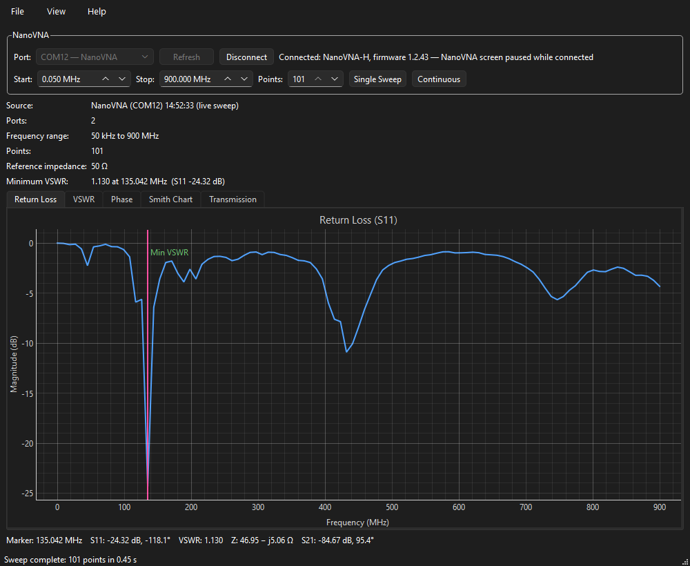
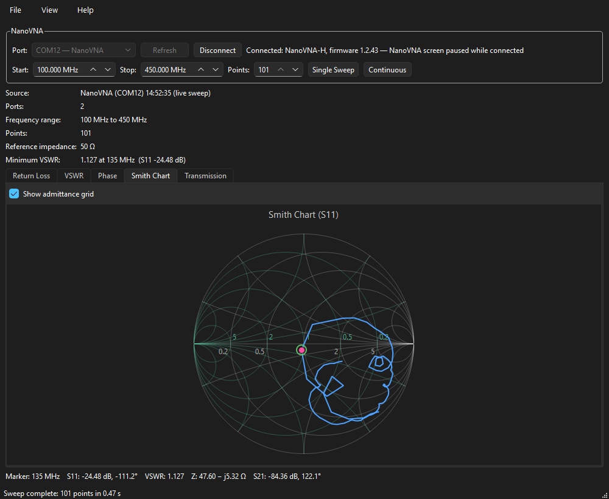
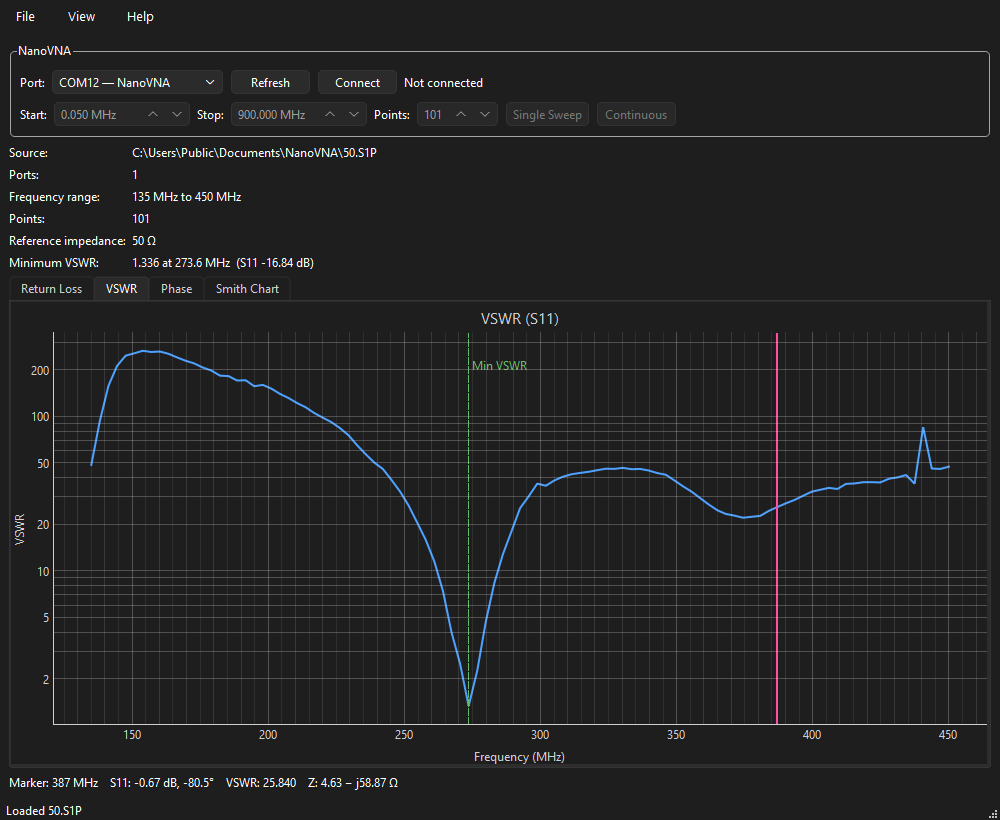

# Nano VNA Viewer

View NanoVNA measurements on Windows and Linux, from saved Touchstone files (`.s1p` / `.s2p`)
or live from a NanoVNA connected over USB.

It replaces the LabVIEW-based Nano VNA LabVIEW Viewer and needs no LabVIEW, NI runtime, or NI-VISA.



## Features

- **Plots:** return loss, VSWR, phase, and a Smith chart (with an optional admittance-grid
  overlay). Two-port data adds a Transmission tab for S21 magnitude and phase. Optional curve
  smoothing between the measured points.
- **Marker:** click or drag to read frequency, S11, VSWR, and impedance (R + jX) at any point.
  The minimum-VSWR point is marked automatically.
- **Live NanoVNA:** single or continuous sweeps over any range; save sweeps as Touchstone files.
- **Export:** plots as PNG, data as CSV.
- Follows the system light/dark theme.

| Smith chart with admittance overlay | VSWR from a saved file |
|---|---|
|  |  |

## Download

Get the latest version from the [Releases page](../../releases). No Python or other software
is needed.

### Windows

1. Download `NanoVNAViewer-<version>-windows-x64.zip` and unzip it.
2. Run `NanoVNAViewer\NanoVNAViewer.exe`. Keep the `_internal` folder next to it.

The app isn't code-signed, so Windows SmartScreen may say "Windows protected your PC".
Click **More info → Run anyway**.

If it fails with "no Qt platform plugin could be initialized", the folder is nested too deeply:
some files inside exceed Windows' 260-character path limit. Move the `NanoVNAViewer` folder
somewhere shorter, such as `Downloads` or `C:\Programs`.

### Linux (x86-64)

```bash
tar -xzf NanoVNAViewer-<version>-linux-x64.tar.gz
./NanoVNAViewer
```

Built on Ubuntu 22.04; runs on that and newer distributions. On X11 desktops Qt needs
`libxcb-cursor0`. If the app doesn't start and mentions the "xcb" platform plugin, install it
(Ubuntu/Debian):

```bash
sudo apt install libxcb-cursor0
```

To use a NanoVNA, your user must be in the `dialout` group (`uucp` on Arch). If connecting
fails with "Permission denied", run this, then log out and back in:

```bash
sudo usermod -aG dialout $USER
```

## Using the viewer

- **File → Open** (Ctrl+O) loads a `.s1p` or `.s2p` file. You can also pass a file on the
  command line: `NanoVNAViewer data.s1p`.
- Click a plot or drag the pink marker to read values at that point. The dashed green line marks
  the minimum VSWR; **View → Go to Minimum VSWR** (Ctrl+M) jumps back to it.
- Scroll to zoom, drag to pan, **View → Reset Zoom** (Ctrl+0) to fit.
- **View → Smooth Curves** draws a smooth curve through the measured points, which are then
  shown as dots. It only changes how the line is drawn: the marker, the readouts, and exported
  data always use the measured points. A feature narrower than the spacing between points
  can't be recovered by smoothing; sweep a narrower range instead.
- **File → Export Plot as PNG** (Ctrl+E) saves the current tab; **Export Data as CSV**
  (Ctrl+Shift+E) saves every point.

### Connecting a NanoVNA

1. Plug the NanoVNA in over USB and switch it on.
2. In the **NanoVNA** panel, pick its port (listed first as "NanoVNA") and click **Connect**.
   Start, Stop, and Points fill in from the device's current sweep.
3. Click **Single Sweep**, or **Continuous** to sweep repeatedly (zoom and marker are kept
   between sweeps of the same range).
4. **File → Save Sweep as Touchstone** (Ctrl+S) saves a `.s2p` (S11 and S21) in the
   NanoVNA's own format.

While the viewer is connected and sweeping, the NanoVNA's own screen is paused; this is
expected. When you disconnect or close the viewer, the device's original sweep settings are
restored and it resumes sweeping. The viewer never writes to the device's flash (no save,
calibration, or reset commands).

If the NanoVNA ever stops responding, the viewer reports it within a few seconds and
disconnects. Switch the NanoVNA off and on, then connect again.

Tested with a NanoVNA-H on firmware 1.2.43 (DiSlord).

## Building from source

Requires Python 3.11 or newer.

```bash
python -m venv .venv
# Windows: .venv\Scripts\activate        Linux: source .venv/bin/activate
pip install -r requirements-dev.txt
```

Run from source (from the project folder, with the virtual environment active):

```bash
# Windows (PowerShell): $env:PYTHONPATH = "src"     Linux: export PYTHONPATH=src
python -m nano_vna_viewer samples/data.s1p
```

Build a standalone app for the current platform (output in `dist/`):

```bash
python packaging/build.py
```

PyInstaller can't cross-compile, so build the Windows version on Windows and the Linux version
on Linux. The GitHub Actions workflow (`.github/workflows/build.yml`) tests and builds both on
every push. Pushing a version tag (e.g. `v0.1.0`) publishes a release with both downloads.

### Tests

```bash
pytest
```

Tests use a simulated NanoVNA. To also run the hardware test against a connected device:

```bash
NANOVNA_PORT=COM12 pytest tests/test_nanovna.py      # Linux: NANOVNA_PORT=/dev/ttyACM0
```

## Sample data

`samples/` has NanoVNA exports to try: `data.s1p` (50 kHz–900 MHz, one-port), `50.S1P`
(135–450 MHz, a resonance near 274 MHz), and `MYSAVE2.S2P` (two-port).

## License

MIT License. Copyright (c) 2026 bitswizzler.io. See [LICENSE](LICENSE).
